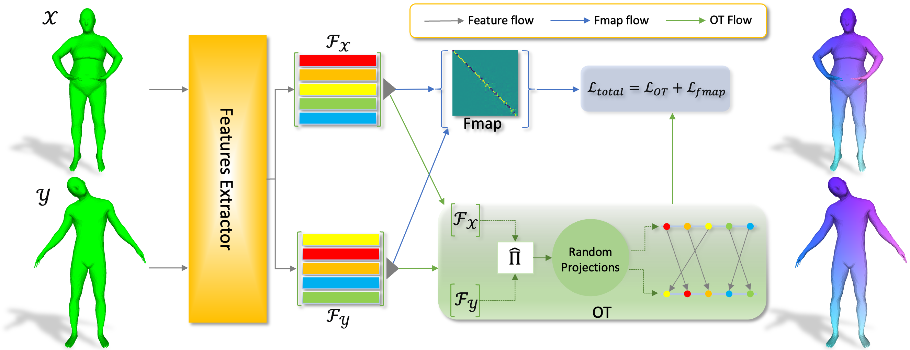

# [Integrating Efficient Optimal Transport and Functional Maps For Unsupervised Shape Correspondence Learning (CVPR 2024)](https://openaccess.thecvf.com/content/CVPR2024/papers/Le_Integrating_Efficient_Optimal_Transport_and_Functional_Maps_For_Unsupervised_Shape_CVPR_2024_paper.pdf)


This is official implementation of CVPR 2024 paper **Integrating Efficient Optimal Transport and Functional Maps For Unsupervised Shape Correspondence Learning**. For more details, please refer to the paper [here](https://openaccess.thecvf.com/content/CVPR2024/papers/Le_Integrating_Efficient_Optimal_Transport_and_Functional_Maps_For_Unsupervised_Shape_CVPR_2024_paper.pdf).

## Abstract
In the realm of computer vision and graphics, accurately establishing correspondences between geometric 3D shapes is pivotal for applications like object tracking, registration, texture transfer, and statistical shape analysis. Moving beyond traditional hand-crafted and data-driven feature learning methods, we incorporate spectral methods with deep learning, focusing on functional maps (FMs) and optimal transport (OT). Traditional OT-based approaches, often reliant on entropy regularization OT in learning-based framework, face computational challenges due to their quadratic cost. Our key contribution is to employ the sliced Wasserstein distance (SWD) for OT, which is a valid fast optimal transport metric in an unsupervised shape matching framework. This unsupervised framework integrates functional map regularizers with a novel OT-based loss derived from SWD, enhancing feature alignment between shapes treated as discrete probability measures. We also introduce an adaptive refinement process utilizing entropy regularized OT, further refining feature alignments for accurate point-to-point correspondences. Our method demonstrates superior performance in non-rigid shape matching, including near-isometric and non-isometric scenarios, and excels in downstream tasks like segmentation transfer. The empirical results on diverse datasets highlight our framework's effectiveness and generalization capabilities, setting new standards in non-rigid shape matching with efficient OT metrics and an adaptive refinement module.

## Environment Setup
```bash 
conda create -n shape-matching python=3.8 # create new viertual environment
conda activate shape-matching
conda install pytorch==2.0.1 torchvision==0.15.2 pytorch-cuda=11.7 -c pytorch -c nvidia # install pytorch
pip install -r requirements.txt # install other necessary libraries via pip
```

## Dataset
The datasets utilized in our experiments can be downloaded from this [link](https://drive.google.com/file/d/1zbBs3NjUIBBmVebw38MC1nhu_Tpgn1gr/view?usp=share_link). Please place all datasets under the ../data/ directory with the following structure:
```Shell
├── data
    ├── FAUST_r
    ├── FAUST_a
    ├── SCAPE_r
    ├── SCAPE_a
    ├── SHREC19_r
    ├── TOPKIDS
    ├── SMAL_r
    ├── DT4D_r
    ├── SHREC20
    ├── SHREC16
    ├── SHREC16_test
```
We acknowledge the original dataset providers for their significant contributions to the shape analysis community; all credits should be attributed to the original authors.

## Data Preprocessing
We follow the preprocessing pipeline of [Unsupervised Learning of Robust Spectral Shape Matching](https://github.com/dongliangcao/Unsupervised-Learning-of-Robust-Spectral-Shape-Matching) to preprocess the datasets. Please refer to the original repository for the processing details.
Here is an example for FAUST_r.
```python
python preprocess.py --data_root ../data/FAUST_r/ --no_normalize --n_eig 200
```

## Train
To train the model on a specified dataset.
```python
python train.py --opt options/train/faust.yaml 
```
We provide the sample yaml file for training on FAUST_r in [options/train/faust.yaml](options/train/faust.yaml). For other datasets, please adapt the yaml file to the corresponding dataset.

The training process can be monitored through wandb.

## Test
To test the model on a specified dataset.
```python
python test.py --opt options/test/faust.yaml 
```
The qualitative and quantitative results will be saved in [results](results) folder.

## Adaptive refinement
An example of adaptive refinement is provided in *[adaptive_refinement_one.py](adaptive_refinement_one.py)*

As described in Section 4.5 of our [paper](https://openaccess.thecvf.com/content/CVPR2024/papers/Le_Integrating_Efficient_Optimal_Transport_and_Functional_Maps_For_Unsupervised_Shape_CVPR_2024_paper.pdf), we implement an adaptive refinement process. An example implementation for a pair of shapes is provided in *[adaptive_refinement_one.py](adaptive_refinement_one.py)*:

```python
python adaptive_refinement_one.py --path_src_shape /path/to/source/shape --path_tar_shape /path/to/target/shape --checkpoint /path/to/checkpoint.pth
```
The results will be saved in **refinement** folder.

## Acknowledgement
We thank the authors of [DiffusionNet](https://github.com/nmwsharp/diffusion-net) for their implementation.

We also thank the authors of [Unsupervised Learning of Robust Spectral Shape Matching](https://github.com/dongliangcao/Unsupervised-Learning-of-Robust-Spectral-Shape-Matching) for their implementation. Our code is built upon their codebase.

## Citation
If you find this work valuable for your research, please consider citing:
```bibtex
@inproceedings{le2024integrating,
  title={Integrating efficient optimal transport and functional maps for unsupervised shape correspondence learning},
  author={Le, Tung and Nguyen, Khai and Sun, Shanlin and Ho, Nhat and Xie, Xiaohui},
  booktitle={Proceedings of the IEEE/CVF Conference on Computer Vision and Pattern Recognition},
  pages={23188--23198},
  year={2024}
}
```